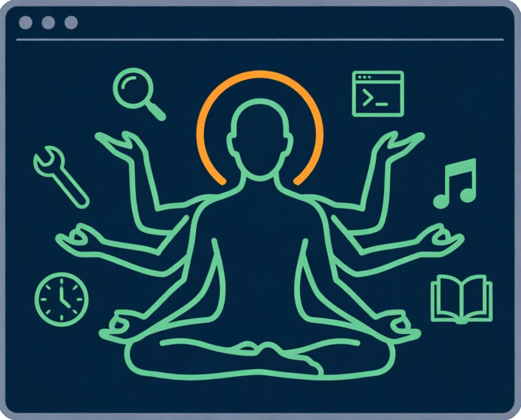
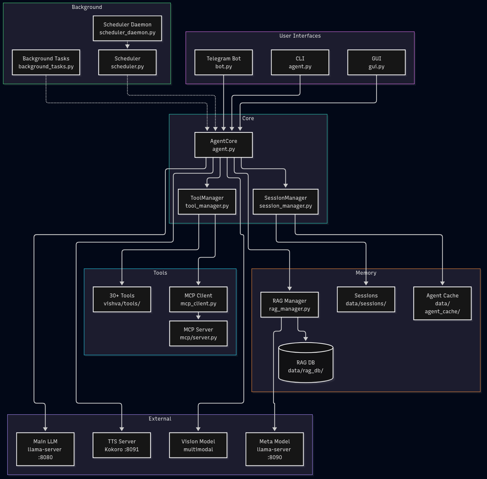

  

<h1 align="center">Vishva 🤖🧘</h1>

<strong>Identity-Driven Autonomous Local Agent</strong>

  <a href="docs/INSTALL.md">Installation</a> •
  <a href="docs/CONFIGURATION.md">Configuration</a> •
  <a href="docs/TOOLS.md">Tools</a> •
  <a href="docs/ARCHITECTURE.md">Architecture</a> •
  <a href="docs/PERSONAS.md">Personas</a> •
  <a href="docs/MCP.md">MCP</a> •
  <a href="docs/BEST_PRACTICES.md">Best Practices</a> •
  <a href="docs/TUTORIAL.md">Tutorial</a>

> [!WARNING]
> **Work in Progress** — Vishva is a **personal project in active development**.
> It works well for the author's daily use, but is under active development. 
> The core agent, RAG memory, tool system and scheduler are functional, but expect rough edges:
> incomplete documentation, occasional bugs, and breaking changes between versions.
> If you find an issue, please [open an issue](../../issues) — feedback is very welcom

---

Vishva is a modular, locally-running LLM agent built around three core principles:

- **Identity** — persistent personality via `SOUL.md`
- **Logic** — operational rules and tool-usage patterns in `ENGINE.md`
- **Action** — dynamic tool-execution layer with MCP support

More than a chatbot: Vishva maintains session context, uses semantic long-term
memory (RAG with meta-model-driven injection/extraction), executes tools,
analyzes images, speaks via TTS, accepts voice input, schedules delayed tasks
with multi-channel delivery, and provides CLI, GUI and Telegram interfaces.

## ✨ Highlights

- 🧠 **Hybrid Memory** — sessions + RAG with automatic extraction/injection
- 🛠️ **30+ Tools** — filesystem, web scraping, product search, subagent, MCP servers
- 🔐 **Confirmation Layer** — destructive operations (bash, file writes, system
  updates, background tasks) require explicit user confirmation
- 🔌 **MCP Support** — Model Context Protocol for external tool servers
- 🎭 **Personalities** — switchable persona templates (default, clean, coder,
  secretary, sharp) — no restart, no history loss
- ⏰ **Scheduler** — delayed tasks with multi-channel delivery (CLI/GUI/Telegram)
- 🖼️ **Vision** — image analysis via multimodal endpoint
- 🎙️ **Voice I/O** — TTS (Kokoro) + STT (Whisper)
- 🏠 **Local-First** — everything runs locally, external services optional

## 🚀 Quick Start

### 1. Prerequisites

Arch / CachyOS / Manjaro:

    sudo pacman -S --needed python python-pip git python-rich curl ffmpeg

Ubuntu / Debian:

    sudo apt update
    sudo apt install python3 python3-pip git python3-rich python3.12-venv ffmpeg curl iproute2

`rich` is only required for the installer UI (system Python!) — the installer
installs all other dependencies itself into its own venv.

RAG (long-term memory) additionally needs a local embedding model — see
[INSTALL.md](docs/INSTALL.md#embedding-models-rag) for download instructions.

### 2. Install

    git clone https://github.com/Zahnschmelz/vishva.git
    cd vishva
    chmod +x *.sh *.py        # make executable (no sudo — your own files)
    ./installer.py            # system scan + interactive setup + venv + deps

The installer scans the system (distro, GPU, audio, network, tools), finds
running AI servers (llama.cpp / Ollama / LM Studio), writes `config/config.json`,
`config/activetools.txt`, activates a persona, and creates `./venv`.

### 3. Onboarding (First Run)

    ./onboarding.sh           # or: python3 vishva/onboarding.py

The agent loads the system scan, conducts a brief interview (~10 questions),
stores what it has learned in long-term memory (RAG), and generates a personal
persona file in `personas/custom/`.

### 4. Start

    ./run.sh          # CLI
    ./run_gui.sh      # GUI
    ./run_bot.sh      # Telegram bot

→ See [INSTALL.md](docs/INSTALL.md) for detailed instructions, systemd services
and troubleshooting.

## 📚 Documentation

| Document | Content |
|---|---|
| [INSTALL.md](docs/INSTALL.md) | Installation, dependencies, embedding models, systemd setup |
| [CONFIGURATION.md](docs/CONFIGURATION.md) | All config keys explained |
| [TOOLS.md](docs/TOOLS.md) | Tool reference with examples |
| [ARCHITECTURE.md](docs/ARCHITECTURE.md) | System architecture + Mermaid diagrams |
| [PERSONAS.md](docs/PERSONAS.md) | Persona system: SOUL / ENGINE / ACTIVETOOLS, switching via `/persona` |
| [MCP.md](docs/MCP.md) | MCP server integration |
| [TUTORIAL.md](docs/TUTORIAL.md) | Step-by-step tutorial |
| [BEST_PRACTICES.md](docs/BEST_PRACTICES.md) | LLM backend setup: two-server pattern, Ollama/LM Studio, reference hardware |

## 🧪 Testing

Inspect and test any tool without starting the agent:

    ./test_tool.sh list              # all tools + active state
    ./test_tool.sh info web_read     # description + parameter table
    ./test_tool.sh call web_read '{"url": "https://example.com"}'

Run the full automated smoke test over all tools:

    ./test/tools.sh                  # add --dangerous for sys_update/sys_clean/turnoff_screen
    ./test/tools.sh --only bash,cd   # test a subset

## 🏗️ Project Structure

    vishva/
    ├── vishva/              # Python package (agent core)
    │   ├── tools/           # individual tool modules
    │   ├── agent.py         # main orchestrator
    │   ├── tool_manager.py  # tool routing + confirmation layer
    │   ├── rag_manager.py   # RAG logic
    │   ├── scheduler.py     # task scheduler
    │   ├── mcp_client.py    # MCP client
    │   └── ...
    ├── config/              # config.json, toolpool.txt, mcp.json
    ├── personas/            # personality templates
    ├── mcp/                 # local MCP server
    ├── data/                # sessions, RAG DB, cache (gitignored)
    └── docs/                # documentation

  

→ See [ARCHITECTURE.md](docs/ARCHITECTURE.md) for details

## 🏆 Best Practices: LLM Backend Setup

Two servers recommended: main model with full GPU offload (`:8080`) plus a
small meta model on CPU only (`-ngl 0`, `:8090`) for RAG enrichment/extraction,
dedup and loop-rescue — it never competes for VRAM.

No separate meta model? Disable the helpers instead of pointing them at the
main model: `"rag_meta_enrichment_enabled": false`,
`"rag_meta_extraction_enabled": false`, `"meta_model_url": ""`.

Ollama / LM Studio can provide the same split (CPU-pinned meta model).

Author's reference hardware: Ryzen 9 9900X + RX 9070 XT (16 GB),
Gemma-4-26B-A4B main + Qwen3.5-4B meta → ~90–100 t/s.

→ Full guide with systemd services, Ollama/LM Studio variants and the complete
reference setup: [docs/BEST_PRACTICES.md](docs/BEST_PRACTICES.md)

## 🚧 Status & Roadmap

Vishva is in active development. Below is a transparent overview of what's
still rough and what's coming next.

### Known Issues

| Area | Issue | Status |
|---|---|---|
| Localization | Some CLI/GUI messages are still in German | 🔧 in progress |
| Documentation | `CONFIGURATION.md` and `INSTALL.md` are being rewritten to match the current code | 🔧 in progress |
| GUI | Settings changes require an app restart in some cases | 📋 planned |
| Vision | No automatic vision model detection — configure `vision_base_url` manually | 📋 planned |

### Roadmap

- [ ] Full English localization of all user-facing strings
- [ ] Documentation pass: update all docs to match current behavior
- [ ] Installer: optional embedding model download
- [ ] Onboarding: save generated personas to a gitignored `personas/custom/` directory
- [ ] Improve test coverage for tool modules
- [x] Confirmation layer for destructive tools
- [x] Scheduler with multi-channel delivery (CLI/GUI/Telegram)
- [x] MCP support (stdio + HTTP)

### Contributing

Found a bug or have an idea? Please [open an issue](../../issues) first so we
can discuss it before you invest time in a pull request.

## 📜 License

MIT License — see [LICENSE](LICENSE)
