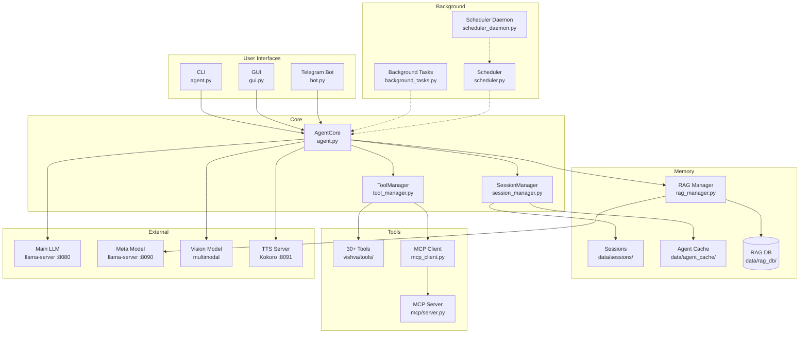
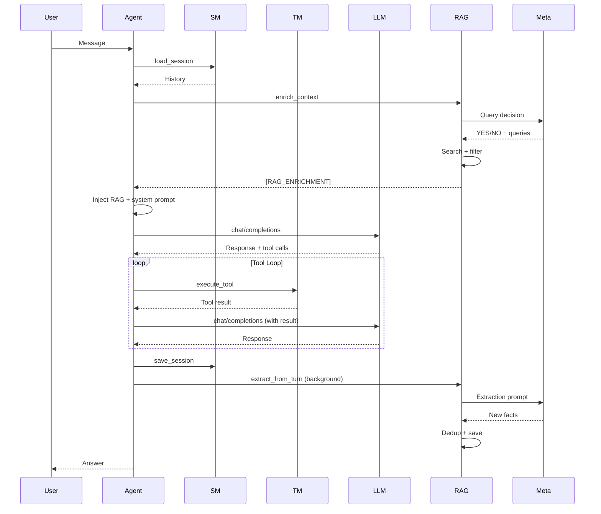
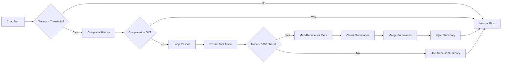

# Architecture

## System Overview

## Components

### AgentCore (`agent.py`)

The central orchestrator:

- Loads config + persona (SOUL.md + ENGINE.md)
- Builds system prompt (static + dynamic)
- Manages sessions
- Executes tool loops
- Protects context (compression, loop rescue)
- Injects RAG context (`[ESSENTIAL_CONTEXT]` / `[RAG_ENRICHMENT]`)
- Extracts new knowledge (via meta model)

### SessionManager (`session_manager.py`)

Session and context management:

- JSON session storage
- Token counting (server-side or tiktoken)
- History compression (via meta model)
- Tool result offloading (to `data/agent_cache/`)
- Tool TTL handling

### ToolManager (`tool_manager.py`)

Dynamic tool routing:

- Loads tools from `vishva/tools/`
- Manages `toolpool.txt` + `activetools.txt`
- Executes tools
- Enforces the confirmation layer for destructive tools
- Integrates MCP servers

### RAGManager (`rag_manager.py`)

Semantic long-term memory:

- Embeddings via local sentence-transformer models
- NumPy matrix scoring (fast)
- Meta model enrichment (query decision + filter)
- Meta model extraction (auto-extraction after turn)
- Dedup (vector similarity + meta model borderline)
- Access tracking + aging + rotation

### Scheduler (`scheduler.py` + `scheduler_daemon.py`)

Task scheduling:

- Delayed tasks with trigger time
- Multi-channel delivery (CLI/GUI/Telegram)
- Claim/TTL mechanism for concurrency
- Desktop notifications + sound
- Terminal opening via `pstree` detection

### MCP Client (`mcp_client.py`)

Model Context Protocol integration:

- Stdio transport (subprocess)
- HTTP transport (Streamable HTTP + SSE)
- Lazy connect + auto reconnect
- Dynamic tool registration

### Personas (Identity Layer)

The agent's identity is assembled at runtime from three live files:

- `personas/_active/SOUL.md` — personality, tone, language
- `personas/_active/ENGINE.md` — operational directives and tool discipline
- `config/activetools.txt` — the active tool set

Persona templates (`personas/<name>.md`) bundle all three layers into a single
file and are applied via `/persona <name>` — without restart and without losing
session history. The onboarding assembles personal personas from
`personas/snippets/` into `personas/custom/`. SOUL + ENGINE are injected into
the system prompt on every request; ACTIVETOOLS filters the tool pool offered
to the model.

→ Full format reference and examples: [PERSONAS.md](PERSONAS.md)

## Data Flow

### Chat Request

### Context Protection

## File Structure

    vishva/
    ├── vishva/                    # Python package
    │   ├── agent.py              # AgentCore (orchestrator)
    │   ├── session_manager.py    # Session/context management
    │   ├── tool_manager.py       # Tool routing + confirmation + MCP
    │   ├── rag_manager.py        # RAG logic
    │   ├── rag_storage.py        # RAG persistence
    │   ├── scheduler.py          # Scheduler logic
    │   ├── scheduler_daemon.py   # Standalone daemon
    │   ├── mcp_client.py         # MCP client
    │   ├── background_agent.py   # Meta model client
    │   ├── background_tasks.py   # Systemd background tasks
    │   ├── bot.py                # Telegram bot
    │   ├── gui.py                # PySide6 GUI
    │   ├── tts_manager.py        # TTS integration
    │   ├── paths.py              # Path resolution
    │   └── tools/                # Individual tool modules
    │       ├── bash.py
    │       ├── web_read.py
    │       ├── product_search.py
    │       ├── subagent.py
    │       └── ...
    ├── config/
    │   ├── config.example.json   # Template — copy to config.json
    │   ├── mcp.json              # MCP server config
    │   ├── toolpool.txt          # Tool registry (JSON)
    │   └── activetools.txt       # Active tools
    ├── personas/                 # → see docs/PERSONAS.md
    │   ├── _active/
    │   │   ├── SOUL.md           # LIVE personality (system prompt)
    │   │   └── ENGINE.md         # LIVE directives (system prompt)
    │   ├── snippets/             # Onboarding building blocks
    │   ├── custom/               # Generated personas (gitignored)
    │   └── *.md                  # Templates (applied via /persona)
    ├── mcp/
    │   └── server.py             # Local MCP server
    ├── data/                     # Runtime state (gitignored)
    │   ├── sessions/             # Session JSONs
    │   ├── agent_cache/          # Tool result cache
    │   ├── rag_db/               # RAG vectors + meta
    │   ├── bg_tasks/             # Background task meta
    │   └── scheduled_tasks.json  # Scheduler tasks
    ├── services/                 # Systemd units (generated by installer)
    ├── knowledge/                # RAG knowledge files
    ├── assets/                   # Logos + sounds
    ├── scripts/                  # Helper scripts
    └── docs/                     # Documentation

## Design Principles

- **Local-First** — everything runs locally, external services optional
- **Modular** — tools are individual modules, easily extensible
- **Context-Aware** — RAG + meta model for intelligent memory
- **Resilient** — context protection, fallbacks, auto recovery
- **Safe** — confirmation layer for destructive operations
- **Extensible** — MCP support for external tool servers
